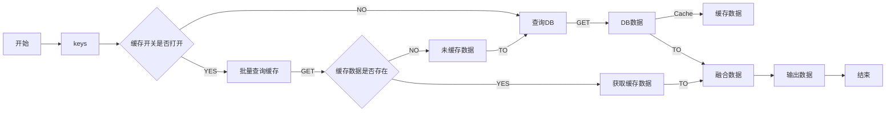

# java-cache-utils

> 简介：工具包封装了批量查询缓存的功能，缓存中不存在的数据，会去DB中查询，然后聚合数据。使用了构造器模式和函数式编程，提供了链式调用的使用方式。

## 查询流程
> 展示流程图使用了[Mermaid](https://github.com/BackMarket/github-mermaid-extension)工具



## 兼容性

- [x] Java 17
- [x] Java 11
- [x] Java 8

## 安装

### Maven

``` xml
<dependency>
  <groupId>io.github.leavestyle</groupId>
  <artifactId>java-cache-utils</artifactId>
  <version>1.0.1</version>
</dependency>
```

### Gradle Kotlin DSL

``` kotlin
implementation(group = "io.github.leavestyle", name = "java-cache-utils", version = "1.0.1")
```

### Gradle Groovy DSL

``` groovy
implementation group: 'io.github.leavestyle', name: 'java-cache-utils', version: '1.0.1'
```

## Handler介绍

> 代码中封装了不同的xxHandler用于处理不同的缓存情况

### 1. ArrStrCacheHandler

缓存中的值是一个数据数组转成的字符串，即处理一个key可能存在1到n个数据的情况

```
// 例如测试用例中的缓存值
[
	{
		"userId": "1",
		"userName": "name1",
		"userAddress": "address1"
	}
]
```

## 使用

参考代码中的测试用例。

## 注意

### 1. 命名

* `reXX` re表示必须赋值的字段，如果是null，build时会报错。
* `initXX` init表示使用缓存必须赋值的字段，默认是null，不配置会执行DB。
* `opXX` op表示可选字段，有默认值。